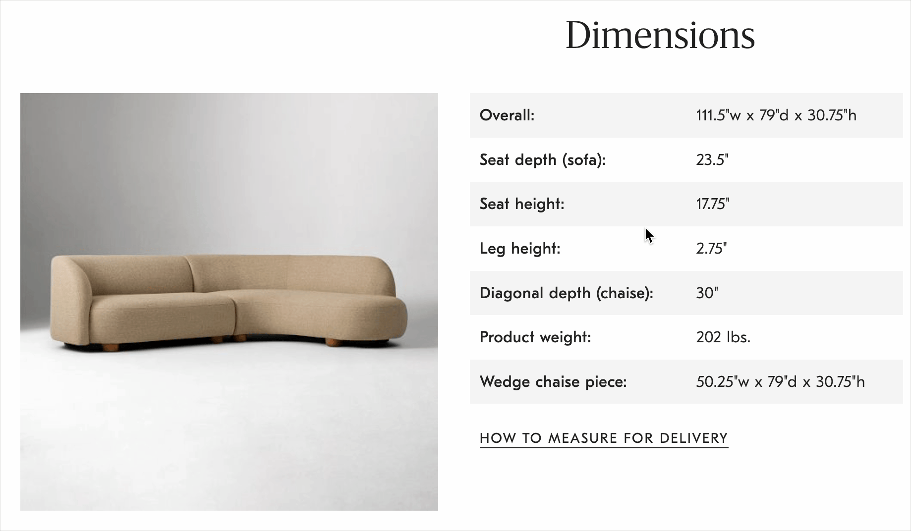

# Metric Please

A lightweight Chrome extension for anyone who grew up with metric units.

Select any text on a webpage containing a US/Imperial measurement — a small tooltip instantly appears showing the metric equivalent.

## Supported Units

| Category | Examples |
|---|---|
| Temperature | `72°F`, `72 F`, `72 Fahrenheit` |
| Length | `25 inches`, `6 ft`, `5'10"`, `10 yards`, `26.2 miles` |
| Weight | `16 oz`, `180 lbs`, `2 tons` |
| Volume | `1 tsp`, `2 tbsp`, `8 fl oz`, `2 cups`, `1 pint`, `1 qt`, `2.5 gal` |
| Area | `1,500 sq ft`, `10 sq yd`, `5 acres`, `3 sq miles` |
| Speed | `65 mph` |

## Installation

1. Download or clone this repo
2. Open `chrome://extensions` in Chrome
3. Enable **Developer mode** (top-right toggle)
4. Click **Load unpacked** and select the repo folder